# Gaiaflow Documentation

**Gaiaflow** is a **local-first MLOps infrastructure tool** that simplifies the process 
of building, testing, and deploying ML workflows.
It provides an opinionated CLI for managing Airflow, MLflow, and other 
dependencies, abstracting away complex configurations, and giving you a smooth 
developer experience.

## Features

- **Local MLOps Infrastructure** via CLI with pre-installed prerequisites.
- **Simplified Airflow + [Xcom](https://airflow.apache.org/docs/apache-airflow/stable/core-concepts/xcoms.html)
  Integration** with an easy interface for DAG creation.
- [**Cookiecutter template**](https://github.com/bcdev/gaiaflow-cookiecutter) for project scaffolding with standardized structure.
- **State-of-the-art services** provided:
    - Apache Airflow
    - MLflow
    - MinIO
    - JupyterLab
- **Containerization** support to package workflow steps as python packages in 
  Docker images.
- **Deployment support**:
    - Local development
    - Minikube production-like testing locally
- **Future roadmap**:
    - Model deploy locally and in production
    - Streamlined production deployment documentation
    - Centralized DAG repository for CI/CD pipelines
    - Private onboarding steps for users


## Gaiaflow-Core

Gaiaflow library provides a simplified interface to create airflow tasks:

`from gaiaflow.core.create_task import create_task`

The `create_task` function is a high-level abstraction on top of 
Apache Airflow operators.

This interface makes it easy and intuitive to develop a DAG in Airflow without
worrying about the complexities of Airflow concepts and configurations about 
running them in different environments allowing you to define tasks for
your DAGs in a uniform way.

Instead of writing different operator classes manually for development, 
containers, or production deployments, `create_task` 
automatically selects the correct operator and applies consistent configuration
based on the `mode` argument.

It supports function execution via a dotted and colon string 
(e.g. `my_package.module:function`) with args/kwargs in any of the supported
modes without changing the user code.

It is configurable with:

- Docker images
- Secrets
- Environment variables
- Retry policies
- Airflow params

Arguments for: `create_task`

| Name             | Type          | Default | Description                                                                                                                                                      |
| ---------------- | ------------- | ------- |------------------------------------------------------------------------------------------------------------------------------------------------------------------|
| **task\_id**     | `str`         | –       | Unique identifier for the task in the DAG.                                                                                                                       |
| **func\_path**   | `str`         | –       | Path to the Python function to execute. Format: `"module:function_name"`.                                                                                        |
| **func\_args**   | `list`        | `[]`    | Positional arguments for the function. The user can also provide output from upstream tasks as args input using the `FromTask` class. Usage shown below.         |
| **func\_kwargs** | `dict`        | `{}`    | Keyword arguments to pass into the function. The user can also provide output from upstream tasks as kwargs input using the `FromTask` class. Usage shown below. |
| **image**        | `str`         | `None`  | Docker image to run the task in `dev_docker`, `prod_local` or `prod` mode. Ignored in `dev` mode.                                                                |
| **mode**         | `str`         | `"dev"` | Execution mode. Must be one of: `["dev", "dev_docker", "prod_local", "prod"]`.                                                                                   |
| **secrets**      | `list`        | `None`  | List of secrets (e.g., Kubernetes secrets) required by the task in `prod_local` or `prod` mode.                                                                  |
| **env\_vars**    | `dict`        | `{}`    | Environment variables to inject into the task. Can be used in `dev_docker`, `prod_local` or `prod` mode.                                                         |
| **retries**      | `int`         | `3`     | Number of times to retry the task on failure.                                                                                                                    |
| **dag**          | `airflow.DAG` | `None`  | Optional reference to the DAG object. Used to inherit DAG-level params. Should be passed if `params` are defined in your DAG                                     |


#### `FromTask`

When building workflows with Gaiaflow, tasks often depend on the **output of a
previous task**.

The FromTask helper makes this easy: it allows you to pull values from upstream 
tasks and use them as arguments in downstream tasks.

**What It Does**
- Provides a simple way to pass values between tasks without writing manual 
[XCom](https://airflow.apache.org/docs/apache-airflow/stable/core-concepts/xcoms.html) 
logic.
- Works seamlessly inside `func_args` and `func_kwargs` of `create_task`.
- Lets you specify:
  - **Which task** to pull from (task)
  - **Which key** inside the upstream task’s return dictionary to extract (key)


Example usage:

```python
from airflow import DAG
from airflow.utils.task_group import TaskGroup
from datetime import datetime
from gaiaflow.core.create_task import create_task
from gaiaflow.core.operators import FromTask

default_args = {
    "owner": "airflow",
}

MODE = "dev"  # or "dev_docker", "prod_local", "prod"

with DAG(
    "my_training_dag",
    default_args=default_args,
    description="Example DAG using create_task",
    schedule="0 12 * * *",
    start_date=datetime(2025, 1, 1),
    catchup=False,
    tags=["ml", "gaiaflow"],
    params={"experiment": "mnist"}, # This will be available to your task via 
                                    # `kwargs[params]`
) as dag:

    with TaskGroup(group_id="training_group") as trainer:
        
        preprocess = create_task(
            task_id="preprocess_data",
            func_path="my_package:preprocess",
            func_kwargs={"path": "/data/raw"},
            mode=MODE,
            dag=dag,
        )

        train = create_task(
            task_id="train_model",
            func_path="my_package:train",
            func_kwargs={
                "epochs": 10, 
                # The key `preprocessed_path` is the kwarg expected by the train method
                "preprocessed_path": FromTask(
                    task="training_group.preprocess_data", # This tells which task to pull the value from
                    key="preprocessed_path", # This tells that we want to extract the value of `preprocessed_path`. 
                    # The previous task must make sure that they return a dict with `preprocessed_path` in it
                    # like return {"preprocessed_path": processed_path}.
                )},
            mode=MODE,
            dag=dag,
        )

        evaluate = create_task(
            task_id="evaluate_model",
            func_path="my_package:evaluate",
            func_kwargs={"metrics": ["accuracy", "f1"]},
            mode=MODE,
            dag=dag,
        )

        preprocess >> train >> evaluate


```

#### Best Practices for passing values from one task to another
- Always make your task functions return a **dictionary of literals**. This ensures 
  downstream tasks can pull values by key.
- Use clear, descriptive keys like `"preprocessed_path"`, `"model_path"`, `"metrics"`.


### Gaiaflow behaviour by `mode`

The `mode` argument in `create_task` controls **where and how your function runs**. 
Internally, each mode maps to a different Airflow operator, with 
environment-specific defaults for networking, MLflow, MinIO, and execution backend.


1. `dev` → **Local Python execution**
     - Airflow Operator: `ExternalPythonOperator`
     - Runs your function directly on the **Python environment** created for you in 
       the docker containers using your dependencies.
     - Ignores the `image`, `secrets` and `env_vars` params.
     - Uses your local `.env` file for environment variables.
     - You will be using this mode most of the time for iteration, development 
       and debugging.
2. `dev_docker` → **Local Docker container execution**
      - Airflow Operator: `DockerOperator`
      - Runs your function inside a **Docker container**
      - Requires `image` parameter
      - You can pass in `env_vars` which are then available as environment 
        variables.
      - This mode is useful when you want to test the docker image locally 
        before moving to Kubernetes which helps you in catching bugs early on.
3. `prod_local` → Simulates production on your machine using **Kubernetes via Local Minikube**
      - Operator: `KubernetesPodOperator`
      - Runs tasks as **Kubernetes pods in Minikube**.
      - Requires `image`
      - You can pass in `env_vars` and/or `secrets` if any. 
      - For creating secrets in your minikube cluster, you can run
```bash
gaiaflow prod-local create-secret -p . --name <your-secret-name> --data SOME_KEY=value --data SOME_SECRET=secret
```
4. `prod` → **Kubernetes in-cluster (production)**
     - Operator: `KubernetesPodOperator`
     - Runs tasks as **Kubernetes pods in Minikube**.
     - Requires `image`
     - You can pass in `env_vars` and/or `secrets` if any. 
     - For creating secrets in your minikube cluster _(coming soon)_

   
Quick rule of thumb:

- Use `dev` for rapid iteration and development.
- Use `dev_docker` to validate your Docker image locally.
- Use `prod_local` for testing end-to-end workflows on production-like settngs.
- Use `prod` for production pipelines in the real cluster.

## User workflow:
A typical user workflow could look like this:

```mermaid
flowchart TD
    A1[Start]--> A
    A{Prerequisites installed except template?}-->|Yes| D{Which OS?}
    A -->|No| STOP[Stop]

    D -->|Windows WSL2| E1[Install template via conda/mamba/miniforge prompt<br/>then create env in WSL2 CLI + install gaiaflow]
    D -->|Linux| E2[Install template + create env<br/>then install gaiaflow]
    E1 --> M
    E2 --> M

    M[Start services in Dev Mode<br/>`gaiaflow start dev -p .`] --> N[Experiment in JupyterLab if needed]
    
    N --> P[Refactor to production code<br/>inside Python package and logging experiements to MLFlow and artifacts to S3 MinIO if needed]
    P --> Q[Write tests in tests/ folder]
    Q --> R[Create workflows with create_task mode=dev in Airflow]
    R --> S[Run & monitor DAG in Airflow]
    S --> T[Track experiments in MLflow & outputs in MinIO]
    T --> V{Workflow ran successfully in dev mode?}
    V --> |Yes| V1{Test your package in docker mode?}
    
    V1 --> |Yes| V2[Change create_task mode to dev_docker and run gaiaflow dev dockerize -p .]
    
    V2 --> V3{Docker mode ran successfully?}
    V3 --> |Yes| V4{Move to production?}
    
    V4 --> |Yes| X1[Start Prod-Local infra<br/>`gaiaflow prod-local start -p .`]
    
    V --> |No| V5[Fix bugs]
    V1 --> |No| STOP[Stop]
    V3 --> |No| V6[Fix bugs]
    V4 --> |No| STOP[Stop]

    V5 --> R
    V6 --> V3
 
    X1 --> X2[Build Docker image<br/>`gaiaflow prod-local dockerize -p .`]
    X2 --> X3[Configure secrets if needed]
    X3 --> Y{Prod-Local Success?}
    Y2 --> Y
    Y -->|Yes| Y1[Set create_task mode to prod - Local services are not needed anymore]
    Y1 --> Z[Deploy to Production Cluster ]

    Y -->|No| Y2[Fix the bugs]

    class A,D,U,Y,V,V1,V3,V4 decision;
    class E1,F1,G1,H1 windows;
    class E2,G2,H2 linux;
    class Z prod;
    class STOP,STOP2 stop;

    classDef decision fill:#FFDD99,stroke:#E67E22,stroke-width:2px;
    classDef windows fill:#AED6F1,stroke:#2874A6,stroke-width:2px;
    classDef linux fill:#ABEBC6,stroke:#1E8449,stroke-width:2px;
    classDef prod fill:#D7BDE2,stroke:#7D3C98,stroke-width:2px;
    classDef stop fill:#F5B7B1,stroke:#922B21,stroke-width:2px;

```


